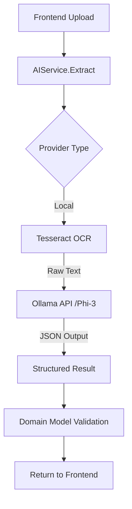

# Architecture: AI Migration v2 (Local)

## Components

### 1. OCR Engine (Tesseract)
- **Responsibility**: Extract text from images (PNG/JPG/PDF).
- **Process**: 
    1. Receive image data.
    2. Save to a temporary file if needed.
    3. Run `tesseract` command or use library.
    4. Return clean text.

### 2. LLM Parser (Ollama + Phi-3)
- **Responsibility**: Transform unstructured text into structured JSON.
- **Model**: `phi3:mini` (chosen for balance of reasoning and speed).
- **Process**:
    1. Construct a system prompt describing the desired JSON structure.
    2. Pass the Tesseract output as user input.
    3. Call Ollama API (`POST /api/generate`).
    4. Parse the response into `ai.ExtractionResult`.

### 3. Backend Integration (Go)
- **Service**: `AIService` remains the entry point.
- **Provider**: `LocalAIProvider` implementing `ai.AIProvider` interface.

## Flow Diagram


## System Prompt Example
```
SYSTEM: You are a data extractor for an ISP management system. 
Given the following raw text from an OCR scan, extract the client information into a JSON object.
FIELDS:
- name (string)
- identity_number (string)
- phone (string)
- email (string)
- address (string)
- package_name (string)
- monthly_fee (number)

If a field is not found, leave it as null.
ONLY return valid JSON.

INPUT:
[Raw text from Tesseract]
```
